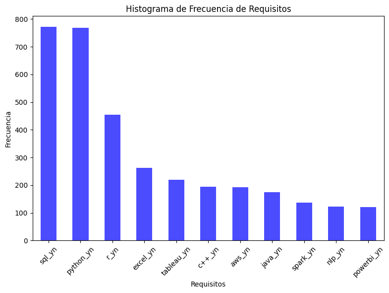
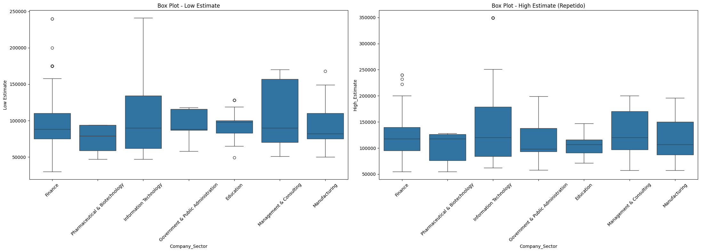

# What Drives Tech Salaries in Australia?

**Python · pandas · statsmodels · scikit-learn · seaborn** · Final project, Data Science course (Coderhouse)

**Question:** if you are moving to Australia for a tech job, which roles, companies and sectors offer the best pay and working conditions?

**Data:** 2,087 data and tech job postings from Glassdoor Australia (public dataset *Australia Data Science Jobs*): salary range, company, sector, company size, required skills (SQL, Python, R, Tableau...) and employee ratings of each company (culture, career opportunities, work-life balance).

## Approach
1. **Cleaning:** dropped columns with little information, imputed missing values (mode for categories, median for ratings), turned the 28 skill flags into booleans.
2. **Exploratory analysis:** salary distribution, salary by sector, company, job title and city, most requested skills, and correlations between ratings and pay.
3. **Statistical tests:** one-way ANOVA confirmed that sector (F = 14.9, p < 0.001), company (F = 37.1) and job title (F = 17.5) each have a significant effect on salary.
4. **Feature selection:** sequential forward and backward selection plus PCA to find the variables that explain salary best.
5. **Model:** linear regression (OLS / scikit-learn pipeline with one-hot encoding), validated on a 20% hold-out set.

## Results
| Model | Variables | R² (test) | RMSE |
|---|---|---|---|
| Full model | 16 variables (role, company, location, industry, ratings, skills) | 0.83 | ~16,000 |
| **Selected model** | **Job title, company, company size** | **0.875** | **~14,000** |

The simpler model explains **87.5% of the variation in salary** with only three variables and predicts better than the model with every variable. Salaries range from roughly 90,000 to 250,000 (Australian dollars).

## Conclusions
- **The role and the employer drive pay** more than anything else: job title, the specific company and its size.
- **Data Scientist, Data Engineer and Data Analyst** are the recommended roles for a good salary.
- **Java and C++** requirements are associated with higher salaries, while **Python and SQL** are the most requested skills overall.
- Company ratings are only weakly correlated with each other, except culture and values with career opportunities.

## Files
- `salary_regression.ipynb`: the full analysis with its outputs (in Spanish). To run it, download `AustraliaDataScienceJobs.csv` from Kaggle into this folder.
