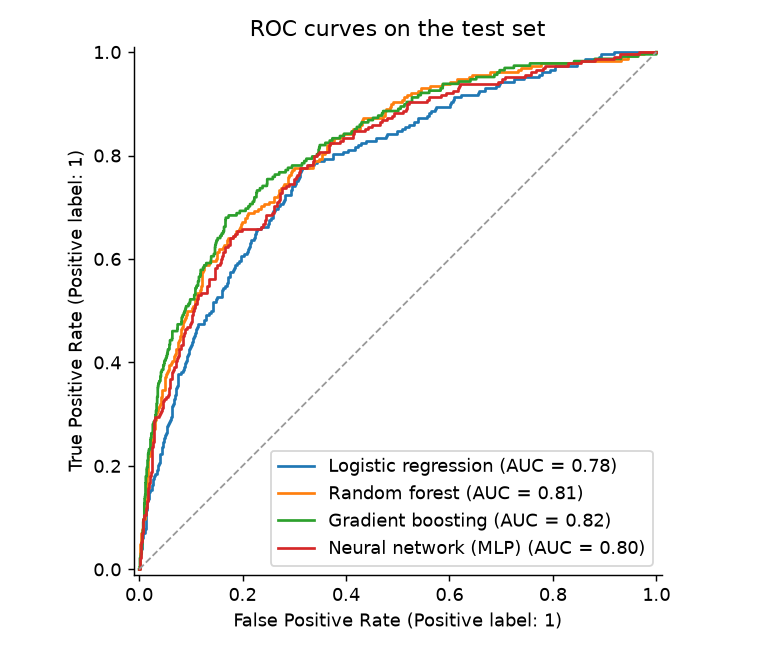
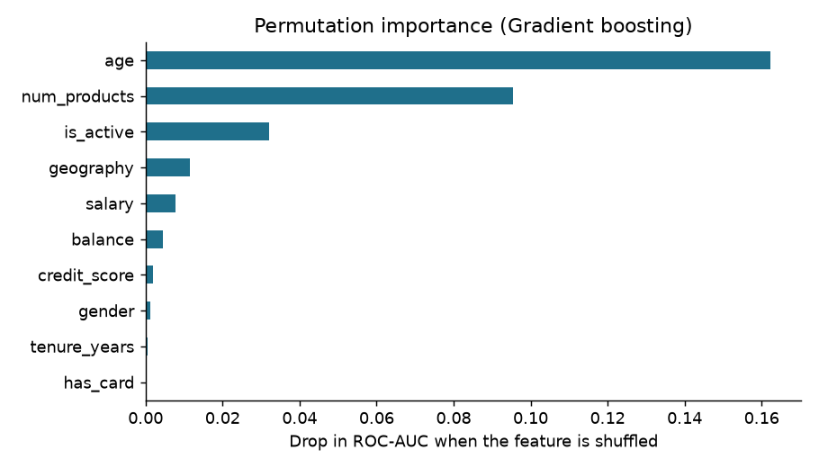

# Customer Churn Model

**Python · scikit-learn · pandas · matplotlib** · Coursework from Coderhouse (Data Science), rebuilt and extended

The course version trained a small neural network on a public bank-churn dataset and reported accuracy. This version does it properly, on a **synthetic** dataset with the same structure whose churn drivers are known in advance. That way the model's explanations can be checked against the truth.

| Model | CV ROC-AUC (5-fold) | Test ROC-AUC | Test accuracy |
|---|---|---|---|
| Baseline (majority class) | 0.500 | 0.500 | 0.886 |
| Logistic regression | 0.760 | 0.779 | 0.885 |
| Random forest | 0.790 | 0.814 | 0.894 |
| **Gradient boosting** | **0.800** | **0.821** | **0.896** |
| Neural network (MLP) | 0.778 | 0.801 | 0.886 |

## What the notebook shows
- **Why accuracy misleads:** with 11% churn, predicting that nobody leaves already scores 88.6%. ROC-AUC measures how well customers are ranked by risk.
- **Leakage-safe pipeline:** scaling and encoding are fitted inside each training fold.
- **Explainability check:** permutation importance recovers the drivers built into the data (age, number of products, activity, region), and gives almost no weight to tenure or card ownership.
- **Business threshold:** with a retention offer costing 1 and a lost customer costing 5, the best threshold is 0.14 instead of 0.5, which cuts total cost by 15%.

Run it with `pip install scikit-learn pandas matplotlib` and open `churn_model.ipynb`. The data is generated inside the notebook with a fixed seed.
