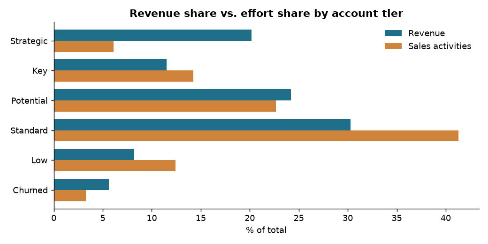

# CRM Sales Effort Analysis

**Python · pandas · matplotlib · (originally Power BI)** · Data Analytics final project, Coderhouse

Between 2018 and 2024 the sales team ran its pipeline in Pipedrive, which I set up and managed. Management's hypothesis was that *the team is not spending its effort where the revenue is*. I tested it with 2,563 deals from 551 accounts.

## Key findings
- **Strategic accounts bring 20% of revenue with only 6% of sales activities.** Revenue per activity is **4.5x** that of Standard accounts.
- Standard and Low-tier accounts absorb **54% of all activities** for 38% of revenue.
- **The top 20% of accounts produce ~59% of revenue** (Pareto curve), so retaining the top tier is the main commercial risk.
- Over 60% of deals have no logged activity, so activity logging needed a shared definition before effort-based KPIs could be trusted.

Recommendations: a contact cadence per tier, automated reorder reminders for smaller accounts, and a dashboard of effort share vs. revenue share per rep. Several of these ideas were later implemented in the ERP (see `../odoo-automation`).

## Files
- `analysis.ipynb`: the full analysis (executed, with outputs).
- `data/crm_deals_anonymized.csv`: the dataset. **Anonymized**: account and rep names replaced, deal values rescaled with noise, free text removed, categories translated to English.

The original deliverable was a Power BI report (data model with deals, accounts and reps tables). It is not published because the `.pbix` embeds the real data.
